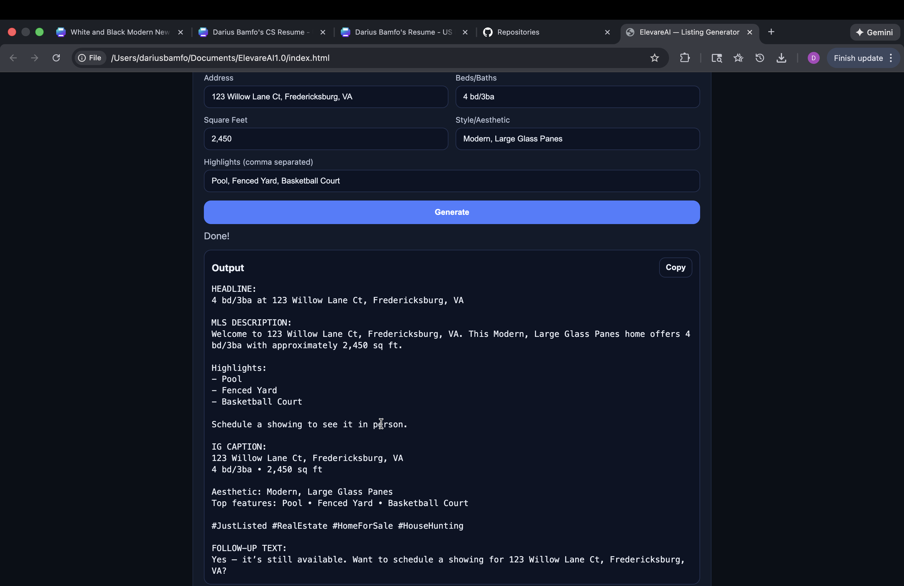
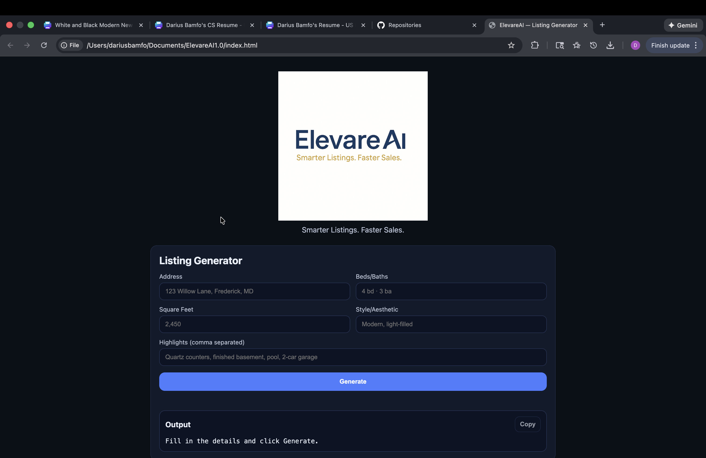

# ElevareAI — Listing Generator (Frontend)

A clean, responsive frontend web app that generates real estate listing copy from basic property details. Built as a UI-focused project to practice form handling, dynamic rendering, and copy-to-clipboard UX.

## Features
- Property input form (address, beds/baths, sqft, style/aesthetic, highlights)
- Instant generated output display
- Copy-to-clipboard functionality
- Clean dark UI with responsive layout

## Tech Stack
- HTML
- CSS
- JavaScript (vanilla)

## Run Locally

Option 1:
- Open `index.html` in your browser

Option 2 (recommended):

```bash
python3 -m http.server 8080

## Purpose

This project was built while transitioning into front-end development to demonstrate practical UI skills, including handling user input, updating the interface dynamically with JavaScript, and building clean, structured layouts. The goal was to create a simple but realistic tool that focuses on usability, visual clarity, and real-world functionality rather than complexity.

## Screenshots

### Generator


### Homepage


---

Built by Darius Bamfo